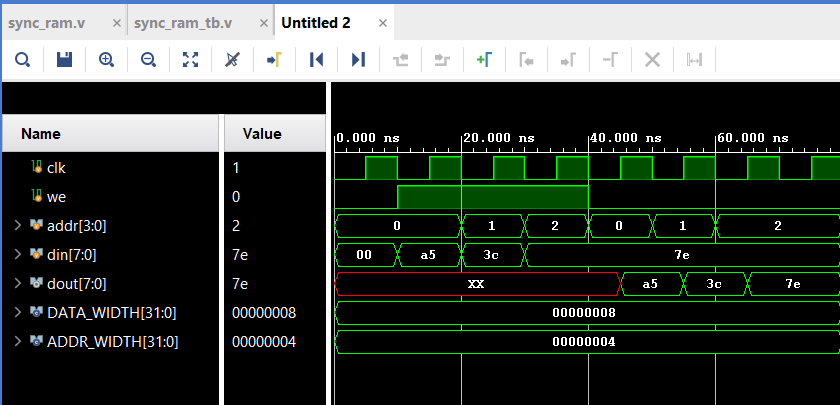

# VLSI_RAM
# Synchronous RAM in Verilog

This project implements a **Synchronous RAM** (Random Access Memory) module in Verilog along with a testbench.  
It demonstrates basic **read and write operations** using a clocked design.

---

## 📂 Files Included

- **sync_ram.v** → Verilog module for synchronous RAM  
- **sync_ram_tb.v** → Testbench for verification  
- **log.png** → Simulation log output (read/write operations at different times)  
- **waveform.png** → Simulation waveform showing signals and memory behavior  

---

## ⚙️ Features

- Parameterized **data width** and **address width**  
- Write operation on positive clock edge when `WE=1`  
- Read operation when `WE=0`  
- Synchronous behavior: both read and write are clock dependent  

---

## 📝 Simulation Results

### Log Output
Example of read/write operations:
Time=0 | WE=0 | ADDR=0 | DIN=00 | DOUT=xx
Time=10000 | WE=1 | ADDR=0 | DIN=a5 | DOUT=xx
Time=20000 | WE=1 | ADDR=1 | DIN=3c | DOUT=xx
Time=30000 | WE=1 | ADDR=2 | DIN=7e | DOUT=xx
Time=40000 | WE=0 | ADDR=0 | DIN=7e | DOUT=a5
Time=50000 | WE=0 | ADDR=1 | DIN=7e | DOUT=3c
Time=60000 | WE=0 | ADDR=2 | DIN=7e | DOUT=7e

### Waveform Output
- **clk** → System clock  
- **we** → Write enable signal  
- **addr** → Address lines  
- **din** → Input data (write)  
- **dout** → Output data (read)  

📌 Applications

- Memory modeling in digital design projects
- FPGA/ASIC design verification
- Learning reference for synchronous memory behavior in Verilog

🧑‍💻 Author:
- saurabh kamble
- https://github.com/Ayanokouji707

